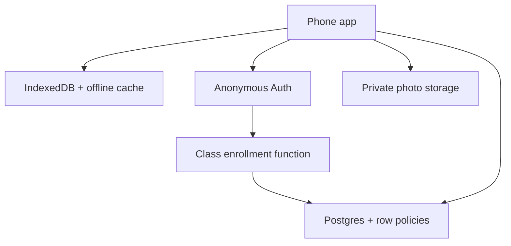

# Architecture and backend choice

## Selected approach

The selected architecture is a static GitHub Pages Progressive Web App plus Supabase Postgres, Auth, Storage, and one Edge Function.

The class code is an enrollment gate, not a user password. After a correct code, the Edge Function adds the phone's anonymous Auth user to one class. Postgres Row Level Security then permits that user to select and update only rows whose `owner_id` matches its signed token. The instructor uses the Supabase dashboard, not a privileged key in the website.

## Options compared

| Option | Strengths | Important limitations | Fit |
| --- | --- | --- | --- |
| **Supabase** | Relational Postgres; built-in anonymous Auth; Row Level Security; private object storage; Edge Functions; convenient SQL/CSV instructor workflow | Free projects pause after one week of inactivity; 1 GB free file storage can be consumed by many photos; no managed backups on Free | **Selected:** least custom infrastructure while meeting ownership, revisions, photos, and export requirements |
| Firebase | Excellent mobile SDKs, anonymous Auth, Firestore offline tooling, mature security rules | Cloud Storage now requires the pay-as-you-go Blaze plan; Functions also require Blaze; document-oriented exports and revision logic are less natural for this ecological table | Technically sound, but no longer the simplest no-billing option for required photos and server logic |
| Cloudflare Workers + D1 + R2 | Generous free request tier, durable serverless SQL/object storage, no sleeping database, full control | Requires custom authentication/capability-token code, admin/export tooling, migrations, and more ongoing maintenance | Strong second choice for an instructor comfortable maintaining a Worker |
| PocketBase/self-hosted server | Simple single binary, built-in records/files/auth, full control | Requires a continuously maintained host, patching, backups, monitoring, and TLS; no natural zero-cost managed host with the same durability | Not recommended for a class field tool |

Current official references used for this decision:

- Supabase Free plan, storage, and pausing: https://supabase.com/pricing
- Supabase anonymous users and RLS: https://supabase.com/docs/guides/auth/auth-anonymous
- Supabase data security and browser publishable keys: https://supabase.com/docs/guides/database/secure-data
- Firebase plan behavior: https://firebase.google.com/docs/projects/billing/firebase-pricing-plans
- Firebase Storage billing requirement: https://firebase.google.com/docs/storage/faqs-storage-changes-announced-sept-2024
- Cloudflare Workers pricing: https://developers.cloudflare.com/workers/platform/pricing/
- Cloudflare D1 limits: https://developers.cloudflare.com/d1/platform/limits/

## Why records are JSON plus an analysis view

One submitted transect is written as a single JSON document. This makes retries idempotent and avoids leaving a half-uploaded set of 300 cell rows. The stable client-generated `record_id` is the primary key, so repeated taps update the same record.

The `analysis_export_long` SQL view expands the document into analysis rows. Each non-detection cell yields one row; each detected species yields one row. This retains all survey effort without making mobile synchronization fragile.

## Revision behavior

Before a submitted `payload` changes, a database trigger copies the previous payload to `transect_revisions`. A repeated upload with identical survey content does not make a revision. The record keeps its original submission timestamp, server modification time, and submission count.

## Photo failure boundary

The transect JSON is uploaded before photos. If one image fails, the record remains on the server and its `sync_state` becomes `upload_partially_complete`; the full survey and all photo blobs also remain in IndexedDB. Retrying uses the same photo and record IDs, so it does not create duplicates.

## Known boundaries

- A browser that has never loaded the app cannot open it offline.
- A phone that has never enrolled cannot submit offline; it can still collect and export locally.
- Clearing browser data destroys that device's anonymous identity and unsaved local photos. A JSON backup is the recovery method.
- The instructor cannot see a draft that never reaches the server.
- Supabase Free storage is appropriate for a class-scale pilot, but image volume should be monitored. Client-side photos are normally resized to a 1600-pixel maximum dimension and JPEG quality 0.82.
