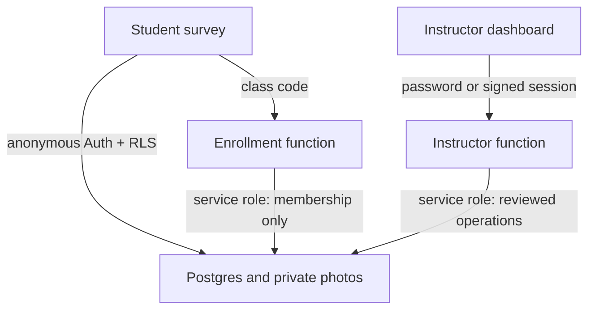

# Security and architecture

## Release design

The v2.1 release extends the existing GitHub Pages/Supabase system; it does not replace the student data path or ecological protocol.

| Surface | Runtime | Access and responsibility |
| --- | --- | --- |
| Student survey | Static GitHub Pages app plus IndexedDB and service worker | Anonymous Supabase Auth; class code enrollment; owner-only database and private-photo access; offline draft/edit queue |
| Instructor dashboard | Separate static GitHub Pages page; online only | Shared password and required reviewer name sent over HTTPS to one protected Edge Function; no direct database access |
| Enrollment service | `enroll-class` Supabase Edge Function | Verifies class code and anonymous user, then uses server privilege only to create/update that membership |
| Instructor service | `instructor-dashboard` Supabase Edge Function | Validates origin, password/session, requests, protocol data, and destructive confirmations; performs narrowly defined class-wide operations using server privilege |
| Durable data | Supabase Postgres and private Storage | Original transects, student revisions, photos, separate curation/state/history, audit, purge ledger, and minimal tombstones |

`config.js` contains the Supabase project URL and publishable key because both are intended for browser use. They are identifiers, not administrative authorization. The database password, service-role key, class code, instructor password, session secret, and rate-limit secret never belong in the repository.

## Student security is unchanged

Each browser profile receives a Supabase anonymous Auth identity. The shared class code is checked only by the enrollment Edge Function; observer names are metadata rather than credentials. Row Level Security requires the authenticated Auth ID to match `owner_id`, and a current membership to insert or update a transect. Photo metadata and private Storage paths are likewise tied to that owner and record.

The v2.1 migration explicitly gives `service_role` the narrow table/function access required by both Edge Functions. This fixes the existing-project case where automatic table exposure was disabled and membership enrollment failed without explicit `SELECT`, `INSERT`, and `UPDATE` on `class_members`. It does not grant anonymous or ordinary authenticated users class-wide data or instructor-table access.

The stable client-generated record ID makes initial submission, uncertain retries, and later student edits idempotent. A trigger freezes record ID, class, owner, and original submission time and archives a former payload whenever the student payload changes.

## Instructor authentication

The dashboard contains no password comparison and never receives a privileged key. Login is a POST to the Edge Function from the exact configured GitHub origin. The function:

1. Requires a non-empty reviewer name.
2. Rate-limits recent failed attempts using a keyed, non-reversible network-subject digest.
3. Compares the supplied password on the server without logging or returning it.
4. Returns a signed, 30-minute token containing the reviewer identity, expiry, nonce, and a credential version derived from the current configured password.
5. Verifies the signature, expiry, reviewer, and credential version on every later request.

The browser stores only the token and reviewer name in `sessionStorage`; it derives the display expiry from the signed token. Closing the tab removes them. Password rotation changes the credential version and invalidates previously issued tokens without a GitHub Pages redeploy. Rotating `INSTRUCTOR_SESSION_SECRET` also invalidates every token immediately.

The function gateway has `verify_jwt = false` intentionally: instructor tokens are application-specific rather than Supabase user JWTs. This does not make the handler unauthenticated; its own origin, login, signature, expiry, authorization, input-validation, and rate-limit checks remain mandatory.

This is deliberately lightweight authentication. It does not provide named accounts, MFA, password recovery, or proof that the self-declared reviewer name belongs to a particular person. Anyone who knows the shared password can exercise instructor powers and enter any reviewer name. Use a unique high-entropy password, share it only with authorized instructors, rotate it when personnel change, and use an institutional secret manager/password manager.

## Instructor data model

Original student payloads remain in `transects`; instructor corrections never overwrite them.

| Object | Purpose |
| --- | --- |
| `instructor_curations` | One current full-payload overlay, its source student revision, version, reason, and reviewer |
| `instructor_curation_revisions` | Previous overlay versions and cleared states |
| `instructor_record_state` | Review status, analysis exclusion, explicit/automatic test status, flags, instructor note, trash state, optimistic version, and purge lock |
| `instructor_actions` | Concise login, curation, state, trash/restore, export/photo-access, and purge events; excludes secrets and full payloads |
| `instructor_login_attempts` | Short-lived inputs for login and purge-password rate limiting; stores only keyed subject digests |
| `instructor_purge_operations` | Retryable handoff ledger between private Storage deletion and transactional database deletion |
| `instructor_purge_tombstones` | Minimal record ID/class/protocol/reviewer/reason/count/time evidence after purge; intended to remain non-sensitive when the reason contains no field data |
| `target_species_catalog` | Server-side allow-list for the versioned 23-code target catalog |
| `instructor_record_summaries` | Service-role-only summary view used for paginated dashboard exploration |
| `instructor_class_summaries` | Service-role-only class/count view used for dashboard bootstrap and class selection |

Browser roles have no table privileges or permissive RLS policies on instructor objects. Only the Edge Function's service-role client can query or mutate them. The service-role key stays in the Supabase function environment.

## Curation and stale-data handling

A curation is a complete protocol-v2 payload overlay rather than a sparse patch. This keeps exports and record detail deterministic while leaving the original untouched. Both the Edge Function and Postgres validate:

- record identity, protocol `2.0.0`, schema `2`, entry method, and species-list version;
- exactly 30 ordered one-meter segments and six unique left/right 0–3 m cells per segment;
- canonical cell IDs, sides, bands, and statuses;
- target codes drawn from the versioned catalog;
- no duplicate species or unknown IDs within a cell; and
- observations only in `detected` cells, with at least one observation there.

A saved overlay records the student's current `submission_count`. If the student later resubmits, the older curation is marked stale and is not silently used as the effective record. An instructor must compare the new original and reapply a valid correction. State and curation writes use version checks so one dashboard tab cannot silently overwrite a newer instructor action.

Exports can request effective curated values (default), originals, or both. “Both” retains explicit source/difference information. Analysis defaults omit trashed, test, and instructor-excluded records unless the instructor affirmatively includes them.

## Trash and purge

Trash is metadata, not deletion. It hides records from normal active views while keeping original payloads, student revisions, curations and curation history, photos, instructor state, and audit history. Restore clears the trash state.

Permanent purge is a separate two-phase operation:

1. The dashboard requests a preview for exact selected trashed record IDs.
2. The server rechecks eligibility, returns exact IDs/photo counts, and signs a short-lived challenge bound to that set.
3. The instructor re-enters the shared password, enters the displayed destructive confirmation, and submits that exact challenge.
4. The server creates/continues a per-record purge operation and locks the record against student resubmission/photo mutation.
5. It validates the canonical private folder and removes only exact Storage objects under that owner/record path.
6. After successful Storage removal, a server-only database function transaction removes record-linked rows and the original transect, writes a minimal tombstone, preserves the purge outcome, and marks the operation complete.

The ledger and tombstone make retry status explicit and block an old cached student client from recreating the same record ID after a confirmed purge. A storage/database interruption is reported per record instead of being presented as success. The operator retries only the exact failed item after investigating; the system never expands a filter into an undisclosed purge set.

The purge reason and reviewer are retained in that tombstone. Keep the reason brief and operational; never copy observer names, coordinates, field notes, photographs, or payload content into it.

## Photos

Survey photos remain in the private `transect-photos` bucket under canonical `owner_id/record_id/filename` paths. Student policies remain owner-only. The instructor function verifies requested photo metadata/path ownership and returns signed URLs with a short expiry; the dashboard never receives a bucket-wide credential.

Photo previews are authorized one at a time only after an instructor requests one; merely opening record detail does not create photo-access audit entries. Expired previews expose a fresh-authorization control. Photo ZIP creation occurs in the browser only for a bounded selection. The function signs at most 100 requested photos at once, and the dashboard caps a single ZIP at 50 files or 75 MiB. Larger selections use a manifest and smaller batches. Missing objects and partial downloads are reported; they are not silently omitted.

## Offline boundary

The service worker continues to cache the student survey shell and IndexedDB continues to retain valid protocol-v2 drafts, photos, membership settings, and retry state. The app version/cache bump does not reset them.

Instructor files and navigation are network-only and are not served the student-app offline fallback. The dashboard therefore requires connectivity. This prevents a cached administrative surface or previously loaded data from being presented as a trustworthy offline view.

The online dashboard loads a pinned Leaflet build from a public CDN with Subresource Integrity. If map tiles or Leaflet do not load, the coordinate-only fallback still represents recorded endpoints without inventing a basemap. The bounded ZIP writer is repository code rather than a privileged server or third-party upload; ordinary CSV/JSON/GeoJSON downloads and the photo manifest remain available if an image bundle cannot be built.

When the OpenStreetMap basemap is active, its public tile server receives ordinary tile requests determined by the approximate filtered GPS extent, plus the browser's IP/network metadata. Record IDs, observer names, notes, popup content, and Supabase credentials are not placed in tile URLs or sent to the tile server. An institution requiring zero third-party coordinate-area disclosure should remove the two external Leaflet tags from `instructor.html` (which activates the built-in coordinate-list fallback) or vendor an approved alternative.

GitHub Pages cannot set a project-defined HTTP `Content-Security-Policy: frame-ancestors` or `X-Frame-Options` header, and a meta `frame-ancestors` directive would not provide that protection. This release therefore does not claim clickjacking protection. Instructors should verify the exact `gavsut.github.io` address and not enter the password into an embedded/framed page. If framing resistance becomes mandatory, front the static site with an approved host/CDN that can set response headers.

The retained identification guide and images remain public static files reachable by direct URL, but no visible student-interface control links to them. They are not part of the mandatory offline survey shell.

## Capacity and request boundaries

- Instructor sessions: 30 minutes; tab-scoped.
- JSON request body: 2 MB; bootstrap supports at most 500 class rows.
- Summary page size: at most 200 records; more than 10,000 matching records requires narrower filters.
- Browser “select all filtered” resolution: 5,000 exact record IDs; narrow filters above that limit.
- Map payload: at most 2,000 GPS-bearing filtered records, with an explicit partial-map notice above the limit.
- Export records per request: 200; the client chunks larger explicit selections and the server rejects oversized requests rather than truncating them.
- Related rows per 200-record export request: 1,000 photo metadata rows, 1,000 audit rows, and 2,000 rows for each revision-metadata collection; use a narrower record batch above a limit.
- Combined original-plus-curation payload preflight: 4 MB per export request.
- Export response: 5 MB per request; use a smaller record batch above the limit.
- Browser long-format assembly: at most 90,000 base cell rows per download operation.
- Browser raw-JSON assembly: at most 200 records per download operation.
- Browser photo-manifest assembly: at most 1,000 records per download operation.
- Bulk trash/restore records per request: 100.
- Permanent purge records per exact signed preview: 20.
- Signed photos per request: 100; record detail and purge also enforce bounded per-record collections.
- Browser-created photo ZIP: at most 50 files and 75 MiB per bundle.
- Summary data: server-paginated; the dashboard must not assume that one capped response is the full class.
- Purge preview: five minutes; regenerate it after expiry or any record/photo change.
- Signed photo URLs: five minutes; regenerate them when expired.

The exact limits keep an accidental or malicious browser request from consuming unbounded Edge Function, database, memory, or network resources. They are operational safeguards, not semester data-retention limits.

## Remaining limitations and acceptance duties

- A record that has never synchronized from a phone cannot appear in the dashboard. The phone's JSON backup is the recovery path.
- Clearing browser storage or losing a student phone can remove drafts, queued photos, and the anonymous ownership identity.
- The shared instructor password is appropriate only for the stated low-complexity risk tolerance; use individual Supabase/Auth accounts if later policy requires attribution, revocation per person, or MFA.
- Map features are created only from recorded GPS. No coordinate is inferred when both endpoints are absent.
- Browser CSV/JSON/GeoJSON/ZIP downloads still depend on browser storage permissions and available memory.
- Backups and audit retention remain an instructor responsibility.
- Local tests do not prove production secrets, CORS, grants, RLS, Storage policies, or the deployed function. Run the live tests in `docs/TESTING.md` after every deployment and at the start of each semester.

## Platform choice

Keeping the existing Supabase backend avoids migrating records and retains Postgres, Anonymous Auth, Row Level Security, private Storage, Edge Functions, and straightforward analysis exports. GitHub Pages remains a simple static host. Firebase or a custom Cloudflare/D1/R2 service could support similar behavior, but either would add migration and custom authorization work without solving a current requirement. Self-hosting would add patching, uptime, and backup responsibilities.

Official references: [Supabase Anonymous Sign-Ins](https://supabase.com/docs/guides/auth/auth-anonymous), [Row Level Security](https://supabase.com/docs/guides/database/postgres/row-level-security), [Edge Function secrets](https://supabase.com/docs/guides/functions/secrets), [private Storage access](https://supabase.com/docs/guides/storage/security/access-control), and [GitHub Pages publishing](https://docs.github.com/en/pages/getting-started-with-github-pages/configuring-a-publishing-source-for-your-github-pages-site).
